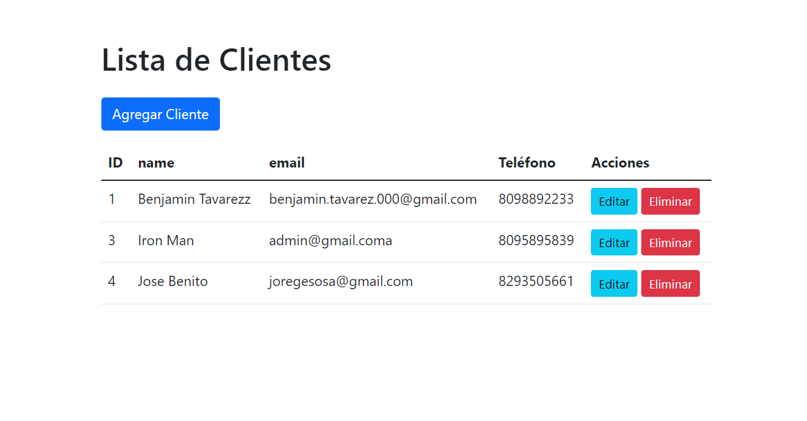

# Proyecto de RUST 

Este proyecto es una aplicación de gestión de clientes desarrollada en Rust utilizando el framework [Warp](https://github.com/seanmonstar/warp) y [Tokio-Postgres](https://github.com/sfackler/rust-postgres) para interactuar con una base de datos PostgreSQL. La aplicación proporciona una interfaz para ver, agregar, modificar y eliminar clientes.

 


## Tecnologías Utilizadas

- **Rust:** Lenguaje de programación principal utilizado para el desarrollo del servidor.
- **Warp:** Framework web para Rust que facilita la creación de rutas y manejo de solicitudes HTTP.
- **Tokio:** Biblioteca utilizada para proporcionar soporte para programación asíncrona.
- **PostgreSQL:** Sistema de gestión de bases de datos relacional utilizado para almacenar la información de los clientes
- **Serde:** Biblioteca de serialización y deserialización para Rust, utilizada para trabajar con datos en formato JSON.

## Estructura del Proyecto

El código está organizado en módulos:

- **`main.rs`:** Contiene la función principal `main` donde se inicializa la conexión a la base de datos y se configuran las rutas del servidor.

- **`routes.rs`:** Define las rutas y operaciones del servidor utilizando el framework Warp.

- **`db.rs`:** Contiene funciones relacionadas con la base de datos, como la inicialización de la conexión y operaciones CRUD en la tabla de clientes.

## Funcionalidades

1. **Ver Todos los Clientes:**
   - Ruta: `POST /clientes`
   - Devuelve un JSON con la lista de todos los clientes almacenados en la base de datos.

2. **Agregar/Actualizar Cliente:**
   - Ruta: `POST /clientes/{id}`
   - Agrega un nuevo cliente si el ID es 0 o actualiza un cliente existente si el ID es mayor que 0.

3. **Eliminar Cliente:**
   - Ruta: `DELETE /clientes/{id}`
   - Elimina un cliente específico según su ID.

## Configuracion interna
### Inicialización de la Base de Datos

La conexión a la base de datos se inicializa en la función `initialize_connection` del módulo `db.rs`. Se utiliza Tokio-Postgres para establecer la conexión y se manejan los posibles errores.

### Modelo de Datos

Se utiliza una estructura `Cliente` con los campos `id`, `nombre`, `correo` y `telefono` para representar los datos de un cliente. Esta estructura se serializa y deserializa utilizando la biblioteca Serde.

### Ejecución del Servidor

Para iniciar el servidor, se llama a `warp::serve(routes).run(([0, 0, 0, 0], 3030)).await;` en la función `main.rs`.

## Aclaraciones

Este README proporciona una visión general del proyecto y su funcionalidad principal. Se recomienda revisar el código fuente para obtener detalles específicos sobre la implementación.


# Rust App con Docker

Este proyecto implementa una aplicación Rust con una base de datos PostgreSQL, empaquetada y ejecutada dentro de contenedores Docker.

## Requisitos

Asegúrate de tener instalados los siguientes componentes antes de ejecutar la aplicación:

- [Docker](https://www.docker.com/get-started)
- [Rust](https://www.rust-lang.org/tools/install)


## Construir y Ejecutar la Aplicación Rust
Este proyecto utiliza el docker-compose para construir y subir las imagenes tanto de la app Rust como la base de datos.

Ejecuta el siguiente comando para inicializar el proyecto

```bash
docker compose up --build
```

La aplicación estará disponible en http://localhost:8080.